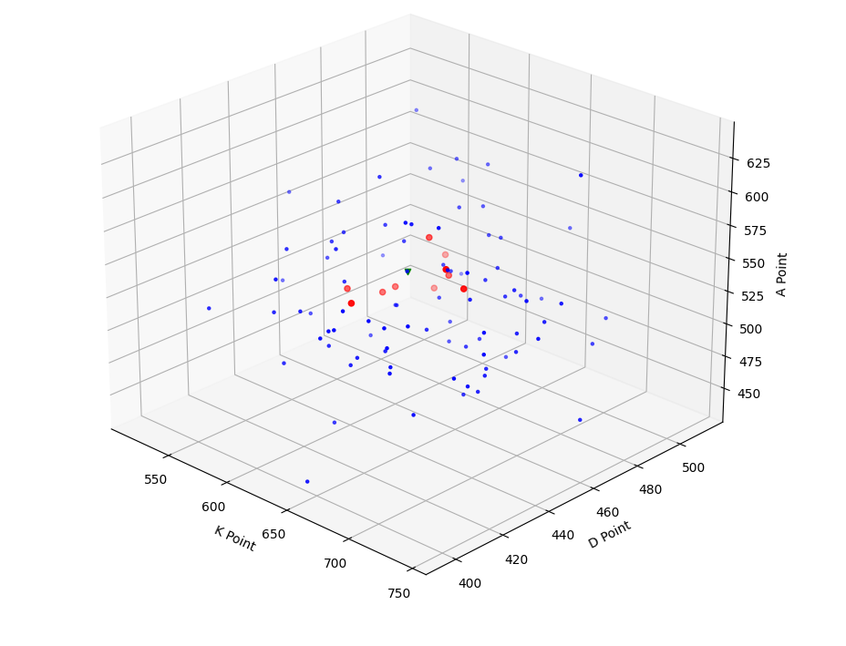
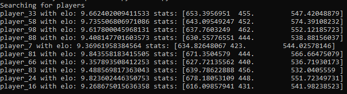

**Vector** is an open database project that aims to solve the **biggest frustration** in modern multiplayer games: inaccurate matchmaking through MMR and ELO systems, which often overshoot or underestimate players' skill levels.

**Vector** seeks to fix this by using an N-dimensional coordinate system for matchmaking and ranking.

### Example: Shooter Game Matchmaking

This example demonstrates how to create a 5v5 player match in a shooter game.

1. **Create the VectorDB for the Game**
    ```python
    vectorDB = Vector(3, np.array([1.2, 0.8, 1.1]))
    ```

    - The first argument specifies the number of dimensions. In this case, we track three stats: **Kills**, **Deaths**, and **Assists**.
    - The second argument defines the weighting of these stats. In shooter games, kills are often the most important stat, while assists and deaths can be adjusted slightly. This still accounts for aggressive players who may have high kills but also high deaths.
    
---

2. **Update Player Stats After Matches**
    ```python
    vectorDB.update("player_name", [17, 5, 7])
    ```

    This tracks players' performance and moves their points within the system.
---

3. **Queue for a Match**
    ```python
    lobby = vectorDB.lobby("player_0", 10, lobby_weights=[1.0, 1.0, 1.0])
    ```

    - **"player_0"** searches for a **10-player** match.
    - `lobby_weights` adjust the search criteria. For role-based shooters, these weights help balance the team composition.

    Example: If "player_0" queues as a **damage** role, we could use weights like **[0.5, 1.2, 1.5]**. This configuration prioritizes finding teammates who have higher deaths (likely tank players) and more assists (likely support players).
---

4. **The Lobby Visualization**
   

   With weights **[1.0, 1.0, 1.0]**, the players in the lobby (red circle) are positioned near the player (green triangle) on all axes.

   

   The displayed stats reflect this balance. The **ELO** in this system is determined by the Euclidean distance from the starting point, representing the player's overall performance.

